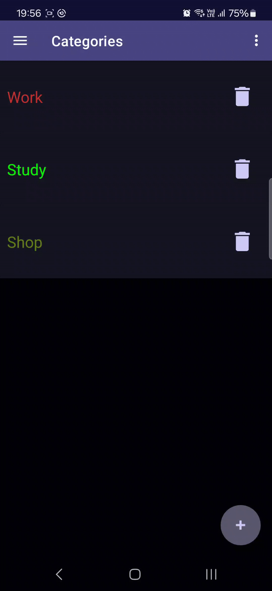

# Memofy

 

     

App organizing your tasks and memos.

## Features

- Create, edit and delete tasks and memos.
- Organize tasks by assign your categories.
- Filter tasks by name and category.
- Schedule and personalize deadline notifications.
- Attach files.

## Release

`
v1.0
`

## Technologies

- Android SDK 34
- JVM 1.8
- Gradle 8.2.2
- Kotlin 1.9.22
- Room 2.3.0
- Navigation 2.7.7
- Lifecycle 2.8.0
- Databinding 8.4.1
- Work 2.7.1

## Preview

     

